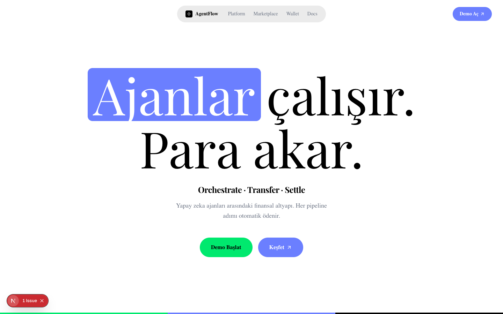

# AgentFlow — AI Agent Orchestration & Wallet Platform

AgentFlow, yapay zeka ajanları arasındaki finansal altyapıdır. Orchestrator Engine her ajanı doğal dil ile tetikler; wallet sistemi ödemeleri otomatik olarak on-chain'e yazar.

> **MVP Demo** — Tüm veriler simüle edilmiştir. Gerçek API entegrasyonu içermez.

---

## Ekran Görüntüleri

### Landing Page


### Dashboard


### Agent Marketplace


### Pipeline Oluşturucu


### Agent Wallet


### Ayarlar


---

## Özellikler

- **Orchestrator Engine** — Doğal dil prompt'ından intent çıkarır, marketplace'den en uygun ajanları seçer ve pipeline'ı kurar
- **Agent Wallet** — Her ajanın kendi on-chain cüzdanı; bakiyeler ve transferler gerçek zamanlı izlenir
- **Otomatik Settlement** — Orchestrator bir adımı onayladığında ödeme milisaniyeler içinde bir sonraki ajana aktarılır
- **Pipeline Görselleştirme** — React Flow canvas ile canlı ajan akışı
- **Blockchain Şeffaflığı** — Tx hash, blok numarası, gas maliyeti — değiştirilemez kayıt
- **AGT Token** — Mikro ödeme optimizasyonu için native token desteği

---

## Teknik Yığın

| Katman | Teknoloji |
|---|---|
| Framework | Next.js 14 (App Router) |
| Dil | TypeScript |
| Stil | Tailwind CSS |
| Bileşenler | shadcn/ui |
| State | Zustand (localStorage persist) |
| Pipeline Canvas | React Flow |
| İkonlar | Lucide React |
| Fontlar | Geist Sans + Playfair Display |

---

## Kurulum

```bash
git clone https://github.com/ilimyuksel/AgentWallet.git
cd AgentWallet
npm install
npm run dev
```

Tarayıcıda `http://localhost:3000` adresini aç.

---

## Proje Yapısı

```
agentflow/
├── app/
│   ├── page.tsx                  # Landing page
│   └── (app)/
│       ├── dashboard/page.tsx    # Dashboard
│       ├── marketplace/page.tsx  # Agent Marketplace
│       ├── pipeline/page.tsx     # Pipeline oluşturucu
│       ├── wallet/page.tsx       # Agent Wallet
│       └── settings/page.tsx     # Ayarlar
├── components/
│   ├── layout/Sidebar.tsx
│   ├── agents/AgentCard.tsx
│   ├── pipeline/PipelineCanvas.tsx
│   └── wallet/WalletCard.tsx
├── lib/
│   ├── store.ts                  # Zustand store
│   ├── orchestrator.ts           # Pipeline simülatörü
│   └── utils.ts
├── data/
│   └── mock.ts                   # Mock ajan ve transaction verisi
└── types/
    └── index.ts                  # TypeScript tipleri
```

---

## Sayfa Açıklamaları

### Landing (`/`)
OpenServ tarzında editorial tasarım. Serif display başlıklar, dashed bölüm ayırıcılar ve organic blob görsellerle AgentFlow'un değer önerisini anlatır.

### Dashboard (`/dashboard`)
Aktif pipeline sayısı, bağlı ajan sayısı, toplam bakiye ve işlem sayısını gösteren stat kartları. Hızlı prompt girişi ile doğrudan Pipeline sayfasına yönlendirir.

### Marketplace (`/marketplace`)
8 mock ajan; kategori filtresi ve arama ile listelenir. Her ajan kartında gradient ikon, fiyat, bakiye ve bağlantı durumu gösterilir.

### Pipeline (`/pipeline`)
Doğal dil promptu → orchestrator keyword matching → ajan seçimi → React Flow canvas animasyonu → on-chain transfer logu.

### Wallet (`/wallet`)
Tüm ajan cüzdanları, bakiye progress barları, düşük bakiye uyarısı. Fon ekleme modal'ı ve full transfer geçmişi tablosu.

### Ayarlar (`/settings`)
Profil bilgileri, bildirim toggle'ları ve plan bilgisi.

---

## Lisans

MIT
